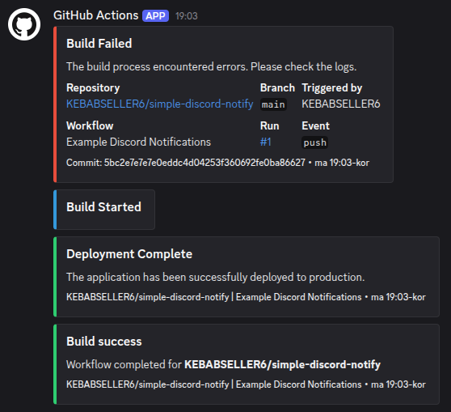

# Simple Discord Notify


A lightweight, zero-dependency GitHub Action to send notifications to Discord via webhooks.
Designed to replace bloated node.js actions with a simple, robust `curl` solution that **doesn't fail silently**.

## Why use this? 🚀

- **Zero Dependencies:** No node_modules, no docker builds, just pure bash & curl. Runs instantly.
- **No Silent Failures:** If the Discord API rejects the payload (e.g. 400 Bad Request), this action fails properly so you know something is wrong.
- **Smart Layouts:** Choose between Minimal, Standard, or Detailed info cards.
- **Status Colors:** Visual feedback for success/failure/warnings.

---



---
<div align="center">
  <h3>Was this vibecoded?</h3>
  <p>Yes. Yes it was. ✨</p>
</div>

## Usage

### Basic Example
```yaml
- uses: kebabseller6/simple-discord-notify@v1
  with:
    webhook_url: ${{ secrets.DISCORD_WEBHOOK_URL }}
    title: "Deployment Complete"
    message: "Successfully deployed to production"
    color: '3066993'
```

## Inputs

| Input | Description | Required | Default |
|-------|-------------|----------|---------|
| `webhook_url` | Discord webhook URL | Yes | - |
| `layout` | Layout style: `minimal`, `standard`, `detailed` | No | `standard` |
| `title` | Notification title | No | `GitHub Action Notification` |
| `message` | Main message content | No | - |
| `status` | Job status for auto-color: `success`, `failure`, `cancelled` | No | - |
| `color` | Manual color override (decimal). Takes priority over `status`. | No | blue |
| `username` | Bot username | No | `GitHub Actions` |
| `avatar_url` | Bot avatar URL | No | GitHub logo |

## Layouts

Choose the amount of information you want to see:

### Minimal
Just a title with color - perfect for simple status pings.

### Standard (default)
Title, message, footer with repo info, and timestamp.

### Detailed
Full context including repository, branch, actor, workflow, run number, and event type as embed fields.

## Color Presets

| Status | Color Value |
|--------|-------------|
| Success 🟢 | `3066993` |
| Failure 🔴 | `15158332` |
| Warning 🟡 | `16776960` |
| Info 🔵 | `3447003` |


## Examples

### Build Status Notification (Auto-Color)
```yaml
- name: Notify Discord
  if: always()
  uses: kebabseller6/simple-discord-notify@v1
  with:
    webhook_url: ${{ secrets.DISCORD_WEBHOOK_URL }}
    title: "Build ${{ job.status }}"
    message: "Workflow run for **${{ github.repository }}** is finished."
    status: ${{ job.status }}
    layout: standard
```

### Detailed Release Notification
```yaml
- name: Release Notification
  uses: kebabseller6/simple-discord-notify@v1
  with:
    webhook_url: ${{ secrets.DISCORD_WEBHOOK_URL }}
    layout: detailed
    title: "🚀 New Release: ${{ github.ref_name }}"
    message: "A new version has been deployed to production! check the changelog."
    color: '3066993'
    username: "Release Bot"
```

## Setup

1. Create a Discord webhook in your server (Server Settings → Integrations → Webhooks)
2. Add the webhook URL as a repository secret named `DISCORD_WEBHOOK_URL`
3. Use the action in your workflow

## License

MIT
